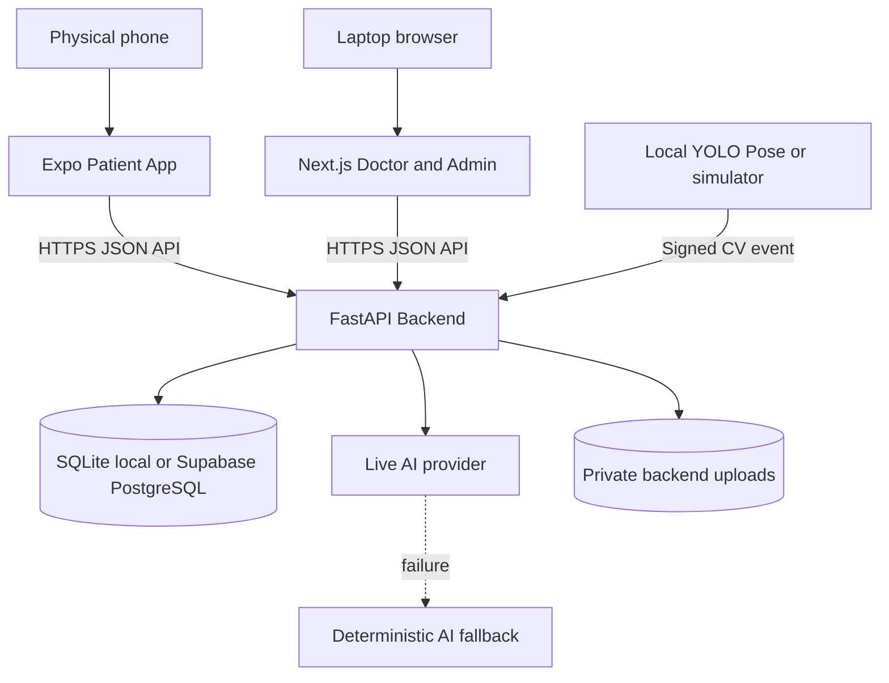

# HealthTech Platform

> An AI-assisted healthcare intelligence layer for continuous patient care, clinician decision support, hospital operations, and patient safety.

**Patient Mobile -> Doctor Web -> Hospital Operations -> Patient Safety**

HealthTech connects longitudinal patient records, consent-aware clinical context, appointment and insurance workflows, operational capacity data, and computer-vision safety events through one FastAPI backbone. It is a hackathon MVP built entirely with synthetic medical data and designed to support human decisions, not replace them.

[Architecture](docs/ARCHITECTURE.md) | [Demo script](docs/DEMO.md) | [Deployment](DEPLOYMENT.md) | [Submission package](docs/SUBMISSION.md) | [Contributing](CONTRIBUTING.md)

## Overview

Healthcare workflows often fragment information across patient files, clinician tools, scheduling systems, operational dashboards, and safety processes. HealthTech demonstrates a connected intelligence layer that turns structured events into explainable insights and then into permissioned, auditable actions.

The core loop is:

```text
Insight or prediction -> Decision support -> Human-approved action -> Updated shared state
```

The platform does not claim to replace an EHR, diagnose conditions, prescribe treatment, or autonomously control hospital operations.

## Problem

- Patients struggle to understand health changes across time and across documents.
- Clinicians spend time finding relevant history and checking whether data access is permitted.
- Appointment, insurance, consent, and queue information often live in separate workflows.
- Hospital teams need a shared view of beds, discharge blockers, tasks, and incoming demand.
- Patient-safety events require fast notification and a clear response trail.

## Solution

HealthTech provides the right information to the right role at the right time:

- Patients receive a longitudinal view of their health, explainable trend summaries, care navigation, booking, and explicit data controls.
- Doctors receive appointment-linked, consent-filtered clinical context and reviewable AI drafts.
- Hospital administrators receive live capacity, discharge, prioritization, and safety workflows.
- A separate CV service turns pose-state transitions into backend safety events without face recognition or identity inference.

## Product interfaces

### Mobile App

All three roles sign in to the native Expo / React Native application in [`apps/patient-mobile`](apps/patient-mobile); the FIN screen routes each role to its own gated section. The citizen journey covers:

- Personal health overview and longitudinal timeline
- Lab trends and comparison views
- PDF, PNG, and JPEG medical-document upload
- Extracted-value review before confirmation
- AI-assisted explanations and specialist suggestions
- Doctor discovery, availability, and appointment booking
- Backend-calculated insurance coverage in AZN
- Time-limited category consent and revocation
- Queue position, post-discharge check-ins, and notifications

Clinician and hospital-operations roles have mobile sections mirroring the web panels below: a clinic list with the consultation workspace, and a capacity command centre with the discharge task chain, safety board, and analytics.

### Doctor Panel

The clinician interface exists both in the mobile app and in the Next.js application in [`frontend`](frontend).

- Daily patients, appointments, and alerts
- Appointment-relationship and consent-aware patient access
- Relevant patient brief and medical timeline
- Consultation workspace and reviewable AI draft
- Missing-information warnings
- Clinician approval before final notes enter the timeline

### Hospital Admin Panel

The operational interface is available in the mobile app and in the same Next.js deployment.

- Command center and 200-bed capacity view
- Department, bed, and patient-flow status
- Discharge blockers and prioritized operational tasks
- Capacity forecast and recommendations
- Room 204 patient-safety alerts
- Nurse task, acknowledgement, resolution, and audit flow

## Main patient journey

```mermaid
flowchart LR
    A[Medical document] --> B[Structured lab result]
    B --> C[Longitudinal trend]
    C --> D[AI explanation]
    D --> E[Specialty suggestion]
    E --> F[Doctor search]
    F --> G[Insurance estimate]
    G --> H[Appointment]
    H --> I[Patient consent]
    I --> J[Doctor patient brief]
```



The extracted document remains untrusted until the patient reviews and confirms it. The doctor brief remains unavailable until both an appointment relationship and matching active consent exist.

## Architecture



FastAPI owns authorization, consent, insurance math, state transitions, audit events, and persistence. AI output is advisory. The recommended hackathon CV topology is a prepared video or simulator on the presentation laptop sending events to the public backend.

See [Architecture Documentation](docs/ARCHITECTURE.md) for component boundaries, domain data, security controls, and deployment topology.

## Technology stack

| Layer | Technology |
|---|---|
| Mobile (all roles) | Expo SDK 54, React Native 0.81, TypeScript, Expo Router |
| Doctor/Admin web | Next.js 15, React 19, TypeScript, Tailwind CSS |
| API | FastAPI, Pydantic, Uvicorn, Python 3.11+ |
| Database | SQLite locally; PostgreSQL/Supabase through `DATABASE_URL` |
| Documents | Multipart upload, signature validation, pypdf extraction |
| AI | Backend provider adapter with live OpenAI-compatible API and deterministic fallback |
| Computer vision | Python, optional Ultralytics YOLO Pose / OpenCV, deterministic simulator |
| Delivery | Docker Compose, Render blueprint, Vercel config, optional EAS build |

## AI layer

AI runs only in the backend. Supported decision-support outputs include lab explanations, specialty suggestions, patient briefs, consultation drafts, missing-information warnings, record-conflict explanations, post-discharge summaries, and hospital recommendations.

The safety contract is explicit:

- Structured context is supplied by the backend.
- Patient text is treated as untrusted data.
- AI cannot authorize access or mutate appointments, consent, beds, discharge, or safety state.
- Invalid, unavailable, or unconfigured live AI falls back to deterministic output.
- Clinical drafts require human review and approval.

## Patient safety and computer vision

The CV service observes explainable pose states such as `LYING`, `SITTING`, and `STANDING`. Stable-frame confirmation and cooldown prevent alert spam. A qualifying transition creates a real `/cv-events` backend event, updates Room 204, notifies hospital operations, and supports nurse dispatch, acknowledgement, and resolution.

The service performs no face recognition, identity recognition, diagnosis, or autonomous clinical action.

## Demo

The deterministic demo tells one connected story:

1. Hasan M. uploads a synthetic lab report and confirms extracted values.
2. HealthTech shows an increasing HbA1c trend and suggests endocrinology review without diagnosing.
3. Hasan books Dr. Leyla Mammadova: `60 AZN`, `48 AZN` covered, `12 AZN` patient payment.
4. Hasan grants time-limited categories; the Doctor panel can then open the relevant brief.
5. The doctor reviews and approves a consultation note.
6. Hospital Admin resolves Patient #104's discharge blocker and releases a bed.
7. The local CV simulator sends a fall-risk event; Room 204 updates in the Admin panel.
8. Demo Reset restores the exact initial state.

Follow the judge-ready [Demo Script](docs/DEMO.md). Product screenshot targets are documented in [`docs/screenshots`](docs/screenshots/README.md).

## Repository structure

```text
healthtech-platform/
|-- apps/
|   `-- patient-mobile/    Expo application for all three roles
|-- backend/               FastAPI API, database, AI, documents, seed, tests
|-- cv_service/            YOLO Pose adapter, simulator, CV tests
|-- frontend/              Next.js Doctor and Hospital Admin application
|-- docs/                  Architecture, demo, submission, screenshot guide
|-- compose.yml            Local Docker stack
|-- render.yaml            Backend deployment blueprint
|-- DEPLOYMENT.md          Cloud and physical-device runbook
|-- .env.example           Safe root environment template
`-- README.md
```

The current structure is intentionally retained because each deployable component already has a clear boundary.

## Local setup

### Prerequisites

- Official CPython 3.11 or newer
- Node.js 22.13 or newer
- npm
- Expo Go on the physical phone
- Docker Desktop, optional

### 1. Backend

From the repository root in PowerShell:

```powershell
python -m venv .venv-win
.\.venv-win\Scripts\python.exe -m pip install -r backend\requirements.txt
$env:PYTHONPATH="backend"
.\.venv-win\Scripts\python.exe -m app.migrate
.\.venv-win\Scripts\python.exe -m app.seed
.\.venv-win\Scripts\python.exe -m uvicorn app.main:app --reload --host 0.0.0.0 --port 8000
```

- API documentation: `http://localhost:8000/docs`
- Health check: `http://localhost:8000/health`

### 2. Doctor and Admin web

```powershell
cd frontend
Copy-Item .env.example .env.local
npm ci
npm run dev
```

Open `http://localhost:3000`, `/doctor`, or `/admin`.

### 3. Mobile app

```powershell
cd apps\patient-mobile
Copy-Item .env.example .env
# Set EXPO_PUBLIC_API_URL to the public HTTPS API or the laptop LAN IPv4 URL.
npm ci
npx expo start --lan
```

Scan the QR code with Expo Go. A phone cannot use `localhost` to reach the laptop.

### 4. CV simulator

With the backend running:

```powershell
$env:PYTHONPATH="cv_service"
$env:CV_BACKEND_URL="http://localhost:8000"
.\.venv-win\Scripts\python.exe cv_service\run_demo.py --simulate
```

## Docker quick start

```powershell
docker compose up --build -d
docker compose ps
```

The web panel is available at `http://localhost:3000` and the API at `http://localhost:8000`. Use `docker compose --profile cv run --rm cv-simulator` for the one-shot simulator.

## Environment variables

| Component | Required configuration |
|---|---|
| Backend | `DATABASE_URL`, `DEMO_MODE`, `CORS_ORIGINS` |
| Backend AI | `AI_PROVIDER`, optional `AI_API_KEY`, `AI_MODEL`, `AI_BASE_URL` |
| Backend CV | `CV_SERVICE_TOKEN`, `CV_HOSPITAL_ID` |
| Mobile (all roles) | `EXPO_PUBLIC_API_URL`, `EXPO_PUBLIC_DEMO_MODE` |
| Doctor/Admin web | `NEXT_PUBLIC_API_URL`, `NEXT_PUBLIC_DEMO_MODE` |
| CV laptop | `CV_BACKEND_URL`, `CV_SERVICE_TOKEN`, `CV_MODEL`, `CV_VIDEO_PATH` |

Use the committed `.env.example` files. Never commit real `.env` files or expose database, AI, service-role, or CV secrets through public frontend variables.

## Demo accounts

| Role (AZ) | Role | Demo FIN | Synthetic identity |
|---|---|---|---|
| Vətəndaş | Patient | `1AZ0001` | `patient@demo.az` |
| Həkim | Doctor | `2AZ0002` | `doctor@demo.az` |
| Xəstəxana | Hospital admin | `3AZ0003` | `admin@demo.az` |

Sign in through the portal screen at `/login` on the web panels or the FIN screen in the mobile app. `POST /auth/login` maps a synthetic FIN and the selected role to the demo identity; the selected role must match the FIN or the request is rejected with 401.

Demo authentication still uses the `X-Demo-User` header, which now carries the email returned by login. Both the endpoint and the header are enabled only when `DEMO_MODE=true`.

## Demo reset and pre-flight

```powershell
# Restore deterministic synthetic data directly.
$env:PYTHONPATH="backend"
.\.venv-win\Scripts\python.exe -m app.seed

# Check a running backend.
.\.venv-win\Scripts\python.exe backend\scripts\demo_check.py

# Reset through the API.
Invoke-RestMethod -Method Post -Uri "http://localhost:8000/demo/reset" `
  -Headers @{"X-Demo-User"="admin@demo.az"}
```

Reset is transactional, demo-scoped, and rejected when `DEMO_MODE=false`.

## Testing

```powershell
$env:PYTHONPATH="backend"
.\.venv-win\Scripts\python.exe -m pytest backend\tests -q

$env:PYTHONPATH="cv_service"
.\.venv-win\Scripts\python.exe -m pytest cv_service\tests -q

cd frontend
npm run build

cd ..\apps\patient-mobile
npm run typecheck
npx expo-doctor
npx expo export --platform android
```

The backend integration suite covers patient-to-doctor synchronization, consent boundaries, document confirmation, appointments, hospital state transitions, CV events, notifications, reset reliability, and security rules.

## Security and privacy principles

- Only synthetic medical data is permitted in this public hackathon repository.
- Patient ownership and role checks are enforced by the API.
- Doctor clinical access requires an appointment relationship and matching active consent.
- Hospital admins receive operational access, not unrestricted clinical histories.
- Uploads are checked by extension, MIME type, size, and file signature.
- Private storage paths and hashes are not returned to clients.
- Sensitive responses receive `no-store` headers; API responses include security headers.
- AI keys, database credentials, and CV tokens remain server-side.
- Audit events record sensitive workflow actions.

See [SECURITY.md](SECURITY.md) for the public-repository policy and reporting guidance.

## Known MVP limitations

- Authentication is synthetic demo-header authentication; Supabase Auth is not implemented.
- Supabase PostgreSQL is supported, but this repository does not use Supabase Storage.
- Uploaded files require a persistent backend disk in cloud deployments.
- Realtime behavior uses reliable polling rather than push notifications or WebSockets.
- Live AI requires a server-side provider key; deterministic fallback works without one.
- Prepared-video YOLO mode needs optional model dependencies and hardware; the simulator is the reliable fallback.
- Physical-device, public-cloud, and live-provider verification require external accounts and credentials.
- No open-source license has been selected; default copyright rules apply.

## Future work

- Replace demo headers with production identity and token validation.
- Add private object storage with signed access.
- Add production observability, backups, recovery testing, and compliance review.
- Add native push notifications and a formal realtime transport where justified.
- Run clinical, accessibility, security, and human-factors validation before real-world use.

## Hackathon and team

HealthTech is a hackathon MVP maintained in the public [`nhesen/healthtech-platform`](https://github.com/nhesen/healthtech-platform) repository. Add final event, team-member, public URL, slide-deck, and demo-video details to [the submission checklist](docs/SUBMISSION.md) before judging.

This project contains synthetic demonstration data only and is not a medical device.
