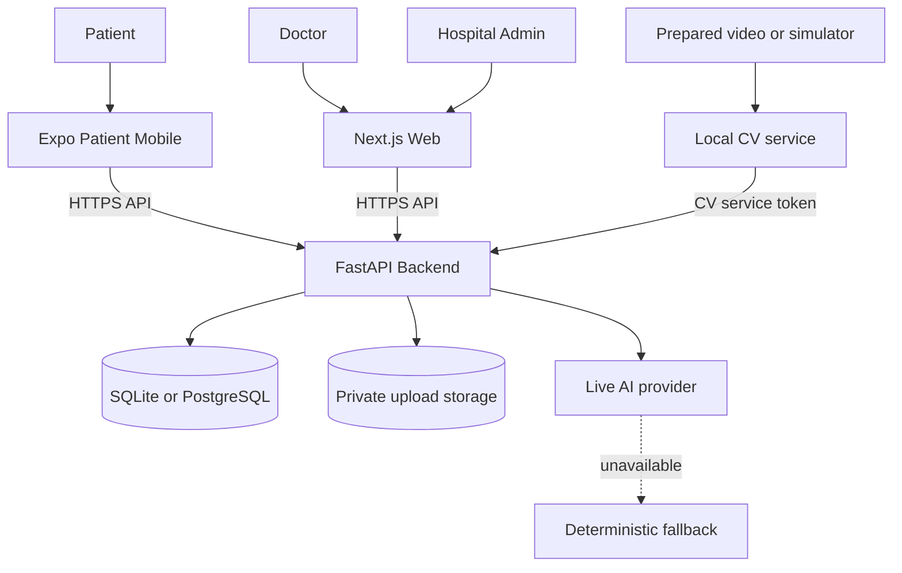
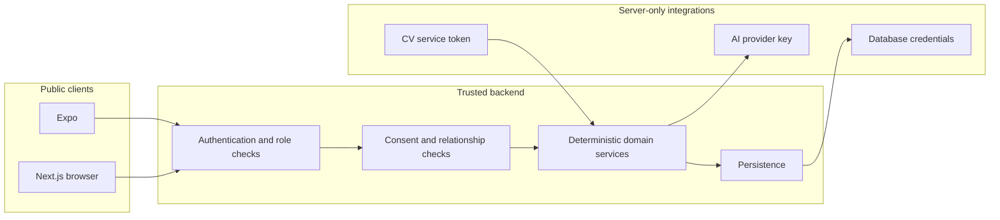
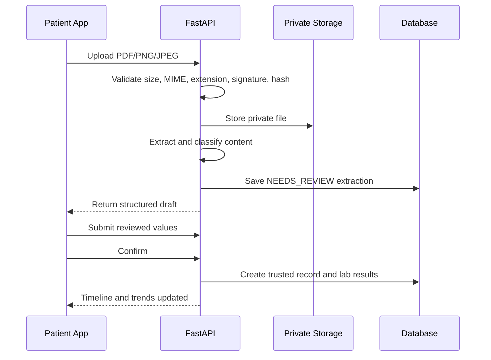
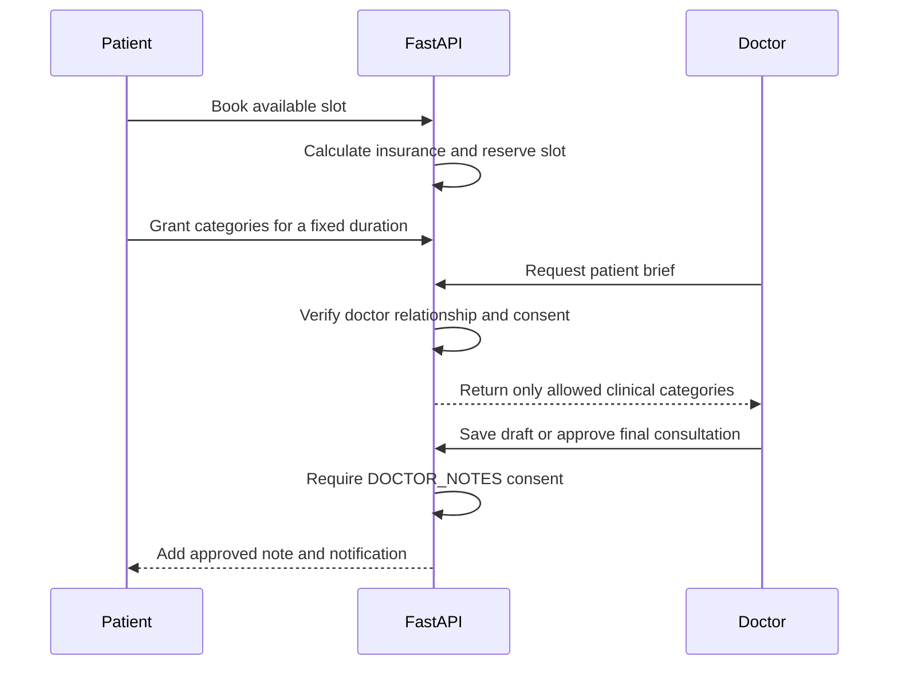
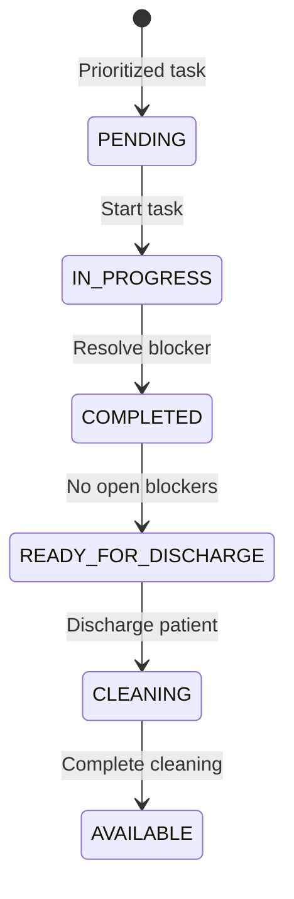
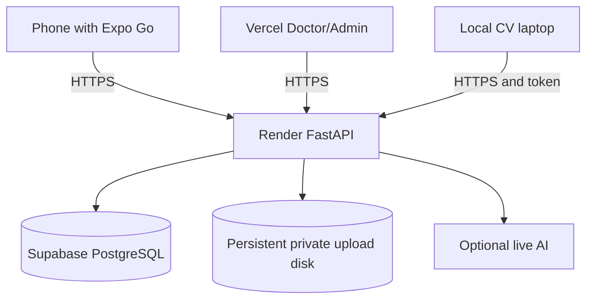

# HealthTech Architecture

## Scope

HealthTech is a healthcare intelligence-layer MVP connecting a patient mobile app, Doctor and Hospital Admin web panels, a shared FastAPI backend, an optional AI provider, and an isolated patient-safety CV service.

It is not an EHR replacement or autonomous medical system. Domain rules and state changes remain deterministic backend responsibilities.

## System context



## Deployable components

| Component | Source | Responsibility | Runtime |
|---|---|---|---|
| Patient mobile | `apps/patient-mobile` | Patient health, documents, booking, consent, queue, follow-up | Expo Go / optional EAS build |
| Doctor/Admin web | `frontend` | Clinician workflow and hospital operations | Next.js 15 |
| Backend | `backend` | API, access control, domain state, persistence, documents, AI adapter | FastAPI / Uvicorn |
| CV | `cv_service` | Pose-state stabilization and safety-event delivery | Python, optional YOLO/OpenCV |

The Doctor and Hospital Admin interfaces intentionally share one Next.js deployment. The patient interface intentionally remains native Expo.

## Backend structure

The MVP backend is compact but has explicit responsibility boundaries:

- `app/main.py`: API routes, domain authorization, schemas, state transitions, and baseline SQL schema
- `app/database.py`: SQLite/PostgreSQL connection adapter
- `app/migrate.py`: idempotent schema and compatibility migration command
- `app/demo_seed.py`: deterministic, synthetic, demo-owned records
- `app/seed.py`: explicit demo restore command
- `app/ai.py`: live-provider adapter and deterministic fallback
- `app/documents.py`: upload validation, extraction, classification, and lab parsing
- `scripts/demo_check.py`: read-only backend readiness check

## Domain model

The baseline migration creates the following groups of tables:

| Domain | Tables |
|---|---|
| Identity and care | `users`, `patients`, `doctors`, `hospitals`, `departments` |
| Clinical history | `medical_records`, `lab_results`, `medical_documents`, `consultations`, `checkins` |
| Access | `consents`, `audit_events` |
| Scheduling and payment context | `availability`, `appointments`, `insurance_plans`, `insurance_coverage` |
| Hospital operations | `beds`, `admissions`, `discharge_blockers`, `tasks` |
| Safety and communication | `rooms`, `cv_events`, `safety_event_details`, `safety_tasks`, `notifications` |
| Demo reliability | `demo_seed_versions` |

SQLite is the zero-configuration local default. A Supabase PostgreSQL connection string can be supplied through `DATABASE_URL`; the application does not require manual SQL after deployment.

## Trust boundaries



No database password, AI key, service-role key, or CV token belongs in `EXPO_PUBLIC_*` or `NEXT_PUBLIC_*` variables.

## Authorization model

The hackathon environment uses synthetic identities through `X-Demo-User` while `DEMO_MODE=true`:

- Patient: access only to the patient profile owned by the synthetic user
- Doctor: clinical access only with a non-cancelled appointment relationship and active category-matching consent
- Hospital Admin: hospital-scoped operational data, not unrestricted patient clinical history
- CV service: token-authenticated event ingestion scoped to the configured hospital

`DEMO_MODE=false` disables demo authentication, reset, and demo shortcuts. Production identity is not implemented and remains a known deployment requirement.

## Patient document flow



Extraction is never automatically trusted. Duplicate files are detected through a patient-scoped hash.

## Patient-to-doctor flow



## Hospital operations flow



Capacity and forecast endpoints derive their results from current bed, admission, blocker, and incoming-demand state.

## AI boundary

The backend selects a live provider only when `AI_PROVIDER=openai` and a server-side key is configured. Any provider failure, timeout, malformed response, or missing key returns deterministic fallback output.

AI may summarize and suggest review points. It may not:

- diagnose or prescribe
- grant or revoke access
- calculate insurance payments
- book or modify appointments
- change tasks, beds, admissions, or safety events
- overwrite source measurements

## Computer-vision boundary

The CV process is separate from the API. It converts video frames into pose states, waits for stable states, applies transition and cooldown rules, and sends a small event payload. Video frames and identity data are not sent to the backend.

Recommended hackathon mode:

```text
Presentation laptop prepared video/simulator
    -> public FastAPI /cv-events
    -> notification and Room 204 state
    -> Admin Safety panel polling refresh
```

## Realtime strategy

The current MVP uses bounded polling:

- Queue: 5 seconds
- Admin operational views: approximately 3 seconds
- Doctor and notification views: approximately 10 seconds

This avoids a hard dependency on WebSockets during a hackathon. Backend state remains authoritative.

## Deployment topology



See `render.yaml`, `frontend/vercel.json`, `apps/patient-mobile/eas.json`, and [DEPLOYMENT.md](../DEPLOYMENT.md).

## Reliability controls

- Idempotent migration command
- Versioned, deterministic demo seed
- Transactional demo reset scoped to synthetic identifiers
- Readiness endpoint and pre-flight script
- Database-enforced uniqueness for active appointment slots
- Validated domain state transitions
- CV stable-frame confirmation and deduplication
- AI fallback and frontend request timeouts
- Polling fallback for live views

## Current limitations

- Demo-header authentication is not production identity.
- Supabase Auth and Storage are not implemented.
- The backend is intentionally compact rather than split into many deployment services.
- PostgreSQL support requires verification against the actual target Supabase project.
- Regulatory, clinical, accessibility, disaster-recovery, and penetration testing remain outside the hackathon scope.
